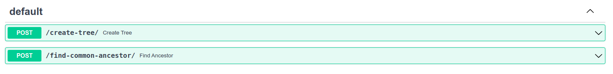

# Binary Tree API

API que tiene dos endpoints. Crear un árbol binario, y encontrar en ancestro más cercano de dos nodos.
Se construyo con FastAPI

## Instalación

1. Debes clonar el repositorio.
```bash
git clone https://github.com/Manticora11/binary_tree_api.git
```
2. Es un proyecto dockerizado, entonces debes construir la imagen.
```bash
docker build -t binary_tree_api .
```
3. Correr el container.
```bash
docker run -p 8000:8000 binary_tree_api
```

## Uso

Puedes dirigirte al [link](http://127.0.0.1:8000/docs#/) que genera FastAPI para su documentación.

Encontraras dos paths


### Endpoint /create-tree/
Para probar el primer endpoint, debes darle click en Try it Out, y agregar en el request body un formato similar al siguiente:
```bash
{
  "nodes": [
    [70, 84, 85],
    [70, 84, 78, 80],
    [70, 84, 78, 76],
    [70, 49, 54, 51],
    [70, 49, 37, 40],
    [70, 49, 37, 22]
  ]
}
```
Le das click en Execute, y te debe mostrar un diccionario con el orden adecuado del árbol que creaste:
```
{
  "val": 70,
  "value": 70,
  "left": {
    "val": 49,
    "value": 49,
    "left": {
      "val": 37,
      "value": 37,
      "left": {
        "val": 22,
        "value": 22,
        "left": null,
        "right": null
      },
      "right": {
        "val": 40,
        "value": 40,
        "left": null,
        "right": null
      }
    },
    "right": {
      "val": 54,
      "value": 54,
      "left": {
        "val": 51,
        "value": 51,
        "left": null,
        "right": null
      },
      "right": null
    }
  },
  "right": {
    "val": 84,
    "value": 84,
    "left": {
      "val": 78,
      "value": 78,
      "left": {
        "val": 76,
        "value": 76,
        "left": null,
        "right": null
      },
      "right": {
        "val": 80,
        "value": 80,
        "left": null,
        "right": null
      }
    },
    "right": {
      "val": 85,
      "value": 85,
      "left": null,
      "right": null
    }
  }
}
```
En la consola se imprime el arbol:
```
tree:  
           _______70_________
          /                  \
     ____49___            ____84
    /         \          /      \
  _37         _54      _78       85
 /   \       /        /   \
22    40    51       76    80
```

### Endpoint /find-common-ancestor/
El proceso es similar al primero, solo que en el request body debes agregar dos parametros:
```bash
{
  "nodes": [
    [70, 84, 85],
    [70, 84, 78, 80],
    [70, 84, 78, 76],
    [70, 49, 54, 51],
    [70, 49, 37, 40],
    [70, 49, 37, 22]
  ],
  "first_number": 40,
  "second_number": 78
}
```
Y te debe retornar un string:
```
"ancestor(40,78) = 70"
```